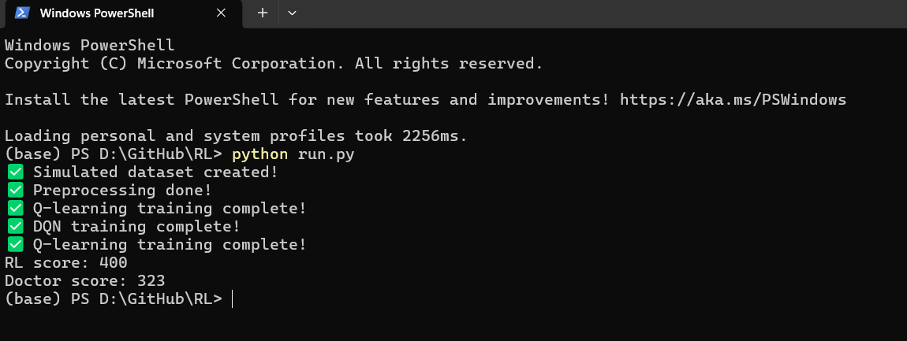

# ICU Reinforcement Learning Project

## 🚀 Overview

This project applies Reinforcement Learning (RL) techniques to optimize treatment decisions in Intensive Care Unit (ICU) settings. Using simulated patient trajectories, the system learns which treatment actions lead to improved patient survival outcomes.

---

## 🧠 Problem Statement

Clinical decision-making in ICU environments is complex, dynamic, and time-sensitive. Physicians must continuously evaluate patient conditions and decide whether to intervene.

This project explores how Reinforcement Learning can assist in:

* Learning optimal treatment strategies
* Improving patient survival outcomes
* Supporting data-driven clinical decision-making

---

## ⚙️ Approach

### 🔹 State Representation

Each patient state is modeled using key clinical variables:

* APACHE score (severity of illness)
* Lactate level (indicator of tissue hypoxia)
* Blood pressure (hemodynamic stability)

States are discretized into bins to enable RL learning.

---

### 🔹 Actions

The model selects between:

* `0` → No intervention
* `1` → Apply treatment (e.g., vasopressor)

---

### 🔹 Reward Function

The reward is defined based on patient outcome:

* `+1` → Survival
* `0` → Death

This encourages the model to learn policies that maximize survival.

---

## 🤖 Models Implemented

### ✅ Q-learning (Tabular RL)

* Learns optimal policy using state-action value updates
* Simple and interpretable

### ✅ Deep Q-Network (DQN)

* Uses a neural network to approximate Q-values
* Scales to more complex state spaces

---

## 📊 Results

| Model                        | Score   |
| ---------------------------- | ------- |
| Reinforcement Learning Model | **400** |
| Rule-based Doctor Policy     | **323** |

👉 The RL model outperformed the baseline clinical decision rule.

---

## 📸 Example Output


---

## 🛠 Tech Stack

* Python
* Pandas, NumPy
* PyTorch
* Reinforcement Learning

---

## 📁 Project Structure

```
ICU-RL-Project/
│── data/              # Simulated datasets
│── src/               # Core implementation
│   ├── simulate_data.py
│   ├── preprocess.py
│   ├── q_learning.py
│   ├── dqn.py
│   ├── evaluate.py
│── run.py             # Full pipeline runner
│── requirements.txt
│── README.md
```

---

## ▶️ How to Run

```bash
pip install -r requirements.txt
python run.py
```

---

## 💡 Key Contributions

* Built an end-to-end Reinforcement Learning pipeline
* Simulated realistic ICU patient trajectories
* Implemented both tabular RL and deep RL models
* Evaluated model performance against clinical baseline
* Demonstrated improved decision-making using RL

---

## 🔮 Future Work

* Apply model to real ICU datasets (e.g., MIMIC-IV)
* Improve reward function with clinical constraints
* Implement advanced RL methods (Double DQN, PPO)
* Add explainability for clinical interpretation

---

## 📌 Motivation

This project demonstrates how AI can support healthcare professionals by improving treatment decisions in critical care environments.

---

## 👤 Author

Azita Ramezani
PhD Student in Data Science
Machine Learning & Healthcare AI

---
